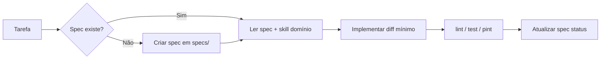

# AGENTS.md — Destino Binacional

Ponto de entrada para agentes de IA neste repositório. Ler **antes** de implementar.

## Stack (resumo)

Laravel 11 + Inertia (React/TS) + Vite + Tailwind + Sanctum + Ziggy. Detalhes: [.cursor/skills/destino-binacional/SKILL.md](.cursor/skills/destino-binacional/SKILL.md).

## Fluxo obrigatório



1. **Spec primeiro** — features/fixes não triviais começam em `specs/` (ver [specs/README.md](specs/README.md)).
2. **Skill de domínio** — usar skill `destino-binacional` para PHP/Inertia/UI.
3. **Diff mínimo** — só o pedido; sem refatoração lateral.
4. **Validar** — `npm run lint`, `npm run test` (JS); `./vendor/bin/pint` + `php artisan test` (PHP).
5. **Git** — branch `feature/…` ou `fix/…`; PR para `main` (ver `.cursor/rules/git-workflow.mdc`).

## Skills do projeto

| Skill | Quando usar |
|-------|-------------|
| `destino-binacional` | Qualquer código neste repo |
| `spec-driven` | Nova feature, mudança de comportamento, refactor planejado |
| `agent-workflow` | Dúvida sobre como o agente deve operar aqui |
| `caveman` | Respostas ultra-curtas ao usuário (`/caveman`, "menos tokens") |

## Regras Cursor (`.cursor/rules/`)

| Regra | Escopo |
|-------|--------|
| `agent-efficiency.mdc` | Sempre — economia de tokens na **operação** do agente |
| `git-workflow.mdc` | Sempre — branches e PR |
| `laravel-php.mdc` | `app/`, `routes/`, `database/` |
| `frontend-inertia.mdc` | `resources/js/` |
| `caveman.mdc` | Opt-in — estilo de **resposta** ao usuário |

## Economia de tokens

**Agente (sempre):** spec antes de código; busca dirigida; leituras paralelas; não reler arquivos já no contexto; parar quando critérios da spec passam.

**Usuário (opt-in):** skill `caveman` ou `/caveman lite|full|ultra` — respostas ~75% mais curtas, precisão técnica intacta.

## Onde não gastar contexto

- `vendor/`, `node_modules/`, `public/build/` — ignorar salvo tarefa explícita.
- Migrations já aplicadas em prod — não editar sem estratégia na spec.

## Comandos rápidos

```bash
npm run dev          # Vite
npm run lint && npm run test
docker compose exec app php artisan test
./vendor/bin/pint
```
